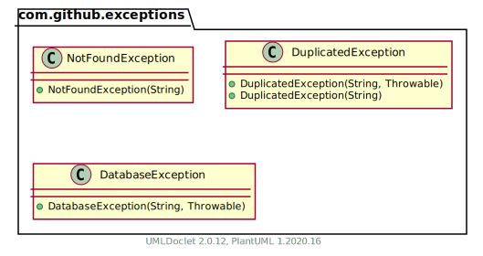

\maketitle
\thispagestyle{empty}
\clearpage
\tableofcontents
\pagenumbering{roman}
\clearpage
\pagenumbering{arabic}
\setcounter{page}{1}

# Funcionalitat
Es una aplicació per mantenir una llista de clients i els videojocs que han comprat.

# Justificació del disseny
L'aplicació està feta al voltant de les dos classes principals que representen el Client i el Videogame.

Per aixó, aquestes dues clases necessiten un DAO especialitzat: ClientDao i VideoGameDAO; que extenen la interficíe DAO que conté els metodes comuns del disseny CRUD.

Tenim 3 tipus d'excepcions:

- NotFoundException: Quan un objecte no és pot trobar, s'utilitza aquesta excepció en comptes de retornar null perque és més explícit.
- DuplicatedException: Quan s'intenta inserir un objecte amb una id duplicada.
- DatabaseException: Aquesta excepció es per qualsevol error intern que pugui tenir la base de dades.

# Mockup / Captures de pantalla

# Diagrama classes UML/E-R

## Package com.github

## Package com.github.db

## Package com.github.exceptions

